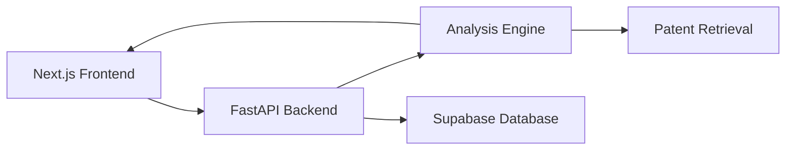
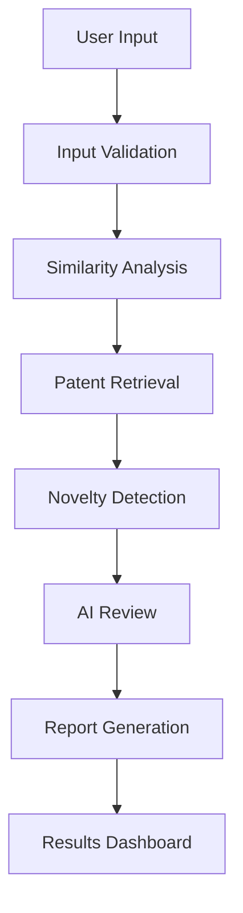

# 🧬 PatentPilot

<div align="center">

### AI-Assisted Freedom-to-Operate (FTO) Workspace for Patent Discovery & Review

*A modern AI-powered platform that helps researchers analyze molecular novelty, retrieve relevant patents, assess potential patent overlap, and generate structured review reports.*


</div>

---

# 📖 Table of Contents

- Overview
- Features
- Overall Architecture
- Retrieval Strategy
- AI Workflow
- Technology Stack
- Project Structure
- Assumptions
- Trade-offs
- Future Improvements
- Running the Project
- Environment Variables
- API Documentation
- Disclaimer

---

# 📌 Overview

PatentPilot is an AI-assisted **Freedom-to-Operate (FTO) workspace** built to support researchers, pharmaceutical teams, patent analysts, and innovation engineers during the early stages of drug discovery and patent research.

The platform enables users to submit molecular information (SMILES notation) along with optional biological context, perform a lightweight patent analysis, estimate novelty and similarity, organize results, and generate structured review summaries.

Rather than acting as a legal decision-making system, PatentPilot is designed as an **AI-powered research assistant** that accelerates early-stage patent exploration.

---

# ✨ Features

- 🧬 Molecular (SMILES) analysis
- 🔍 Patent relevance search
- 📊 Novelty & similarity estimation
- 🤖 AI-assisted patent review workflow
- 📄 Structured patent analysis reports
- ☁ Optional cloud persistence using Supabase
- 🌙 Modern Light & Dark mode interface
- 📱 Fully responsive dashboard
- ⚡ FastAPI backend with automatic Swagger documentation

---

# 🏗 Overall Architecture



The system is divided into three major layers:

### Frontend

- Next.js 16
- React 19
- Tailwind CSS
- Responsive dashboard
- Analysis workspace
- Report interface

### Backend

- FastAPI
- REST APIs
- Input validation
- Analysis orchestration
- Database interaction

### AI & Retrieval Layer

- Similarity scoring
- Novelty estimation
- Patent relevance ranking
- Report generation

Supabase is used for optional persistence. If environment variables are not configured, PatentPilot continues to operate without database storage.

---

# 🔎 Retrieval Strategy

PatentPilot follows a lightweight retrieval-first approach suitable for rapid prototyping and explainable analysis.

The retrieval process consists of:

1. Parsing the submitted SMILES notation.
2. Computing structural similarity using heuristic scoring or RDKit fingerprints (when available).
3. Combining similarity scores with optional biological context such as target and disease.
4. Ranking patent-related candidates using keyword overlap and contextual relevance.
5. Returning the highest-ranked results to the user along with an AI-generated summary.

This approach prioritizes transparency, speed, and modularity while remaining easy to extend with additional retrieval sources.

---

# 🤖 AI Workflow



### Workflow Description

1. User submits SMILES notation with optional target and disease.
2. Backend validates and preprocesses the request.
3. Structural similarity and novelty are estimated.
4. Relevant patent-like records are retrieved and ranked.
5. Findings are summarized into a structured report.
6. Results are displayed on the frontend and optionally stored in Supabase.

---

# 💻 Technology Stack

| Layer | Technologies |
|--------|--------------|
| Frontend | Next.js 16, React 19, TypeScript, Tailwind CSS |
| Backend | FastAPI, Python |
| Database | Supabase, PostgreSQL |
| Chemistry | RDKit (optional) |
| Reports | jsPDF |
| Environment | dotenv |
| Version Control | Git & GitHub |

---

# 📂 Project Structure

```text
PatentPilot/

├── backend/
│   ├── app/
│   │   ├── ai/
│   │   ├── api/
│   │   ├── database/
│   │   ├── services/
│   │   └── main.py
│   │
│   ├── requirements.txt
│   └── .env
│
├── frontend/
│   ├── app/
│   ├── components/
│   ├── public/
│   └── ...
│
└── README.md
```

---

# ⚙ Assumptions

PatentPilot is intentionally designed as an explainable prototype rather than a legal-grade patent intelligence platform.

Key assumptions include:

- Users provide valid molecular structures using SMILES notation.
- Patent information is approximated through lightweight retrieval methods.
- AI-generated summaries assist research and are not legal advice.
- Internet connectivity is available for optional cloud services.
- Patent professionals perform final Freedom-to-Operate decisions.

---

# ⚖ Trade-offs

The project intentionally prioritizes simplicity, maintainability, and rapid development.

Trade-offs include:

- Lightweight retrieval instead of enterprise-scale patent databases.
- Heuristic similarity scoring instead of exhaustive molecular analysis.
- Fast local deployment over large-scale distributed architecture.
- Modular design for future extensibility rather than production optimization.

These decisions make the application easier to understand, extend, and demonstrate.

---

# 🚀 Future Improvements

Potential enhancements include:

- Integration with Google Patents, Lens.org, or SureChEMBL
- Semantic patent retrieval using embeddings
- Vector database integration
- LangGraph multi-agent orchestration
- Claim-level patent comparison
- AI-powered reasoning with evidence citations
- PDF and DOCX report generation
- User authentication and role management
- Real-time collaboration
- Background task processing
- Interactive molecular visualization
- Advanced patent recommendation engine

---

# ▶ Running the Project Locally

## Prerequisites

- Node.js 18+
- Python 3.10+
- Git

---

## Backend

```bash
cd backend

python -m venv venv

# Windows
venv\Scripts\activate

pip install -r requirements.txt

uvicorn app.main:app --reload
```

Backend will be available at:

```
http://127.0.0.1:8000
```

---

## Frontend

```bash
cd frontend

npm install

npm run dev
```

Frontend will be available at:

```
http://localhost:3000
```

---

# 🔑 Environment Variables

Create a `.env` file inside the **backend** directory.

```env
SUPABASE_URL=your_supabase_url
SUPABASE_KEY=your_supabase_key
```

If these variables are omitted, PatentPilot will continue to run in a non-persistent mode without database storage.

---

# 📚 API Documentation

FastAPI automatically generates Swagger documentation.

After starting the backend, visit:

```
http://127.0.0.1:8000/docs
```

---

# ⚠ Disclaimer

PatentPilot is intended for educational and research purposes.

The generated novelty scores, similarity estimates, and patent summaries are AI-assisted outputs designed to support early-stage research. They should **not** be considered legal advice or official Freedom-to-Operate opinions.

Final patentability and legal assessments should always be performed by qualified patent professionals.

---

# 🌟 Future Vision

PatentPilot aims to evolve into a comprehensive AI-powered patent intelligence platform capable of assisting researchers throughout the complete patent discovery and innovation lifecycle using explainable AI, semantic retrieval, and intelligent multi-agent workflows.

---

<div align="center">

### 👨‍💻 Developed by Sai Srineeth

**PatentPilot — AI-Assisted Freedom-to-Operate Workspace**

⭐ If you found this project interesting, consider giving it a star!

</div>
